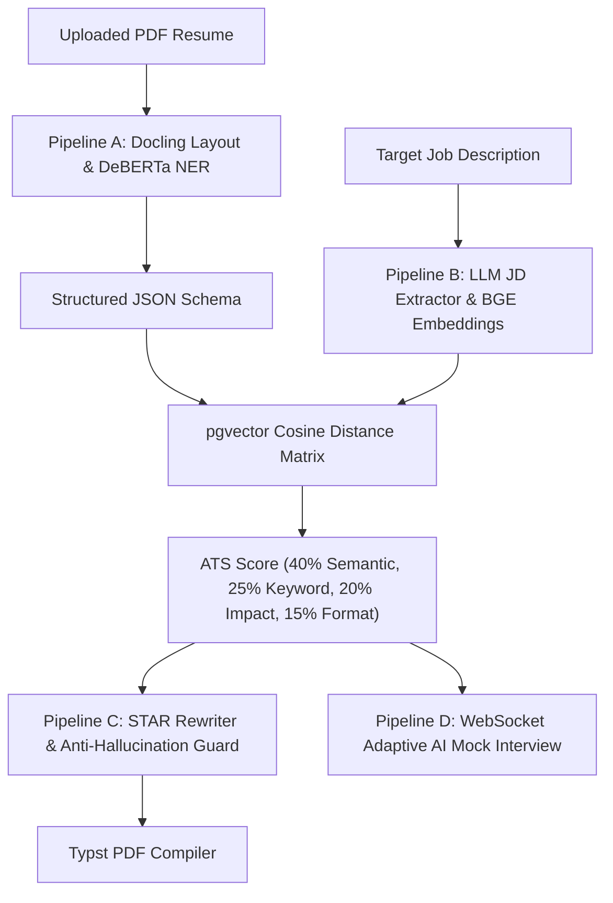

# 🚀 PlaceMind — AI-Powered Resume Intelligence & Adaptive Mock Interview Platform

PlaceMind is an end-to-end, local-first AI platform designed to transform job search preparation. It parses candidate PDF resumes, computes high-dimensional semantic gap matrices against target Job Descriptions using vector similarity search, rewrites bullet points via the STAR method with anti-hallucination guardrails, compiles ATS-safe single-column PDFs, and conducts adaptive AI mock interviews over WebSockets.

---

## 📌 Project Architecture & Directory Layout

PlaceMind is organized as a production-grade monorepo containing the frontend dashboard, backend FastAPI server, machine learning pipelines, and background evaluation suites:

```text
PlaceMind/
├── start.sh                       # 🚀 One-command platform launcher script
├── package.json                   # Root package manager configuration
├── docker-compose.yml             # Container orchestration (Postgres + pgvector, Redis, MinIO)
├── README.md                      # Comprehensive project documentation
├── DEMO_SCRIPT.md                 # Step-by-step live presentation & defense guide
│
├── frontend/                      # 💻 Next.js 14 Dashboard
│   ├── src/app/                   # App Router pages (Upload, ATS Gap, PDF Generator, Live Interview)
│   ├── src/components/            # WinUI 3 styled workspace components (GapReportView, PdfGeneratorView, InterviewRoom)
│   └── src/lib/api.ts             # Type-safe API & WebSocket client
│
├── backend/                       # ⚡ FastAPI & Async Backend
│   ├── app/
│   │   ├── main.py                # FastAPI entrypoint & router mounts
│   │   ├── api/v1/                # REST endpoints (/resume, /jd, /interview, WebSocket /ws)
│   │   ├── core/                  # Configuration & logging infrastructure
│   │   ├── db/                    # Async SQLAlchemy 2.0 database & pgvector queries
│   │   ├── ml/                    # Machine Learning pipelines & inference wrappers
│   │   │   ├── document_parser.py # Docling layout PDF text extractor
│   │   │   ├── ner_extractor.py   # DeBERTa-v3 NER entity extraction (MPS/Metal accelerated)
│   │   │   ├── embedding_service.py # BAAI/bge-large-en-v1.5 sentence embeddings & Redis cache
│   │   │   ├── ats_scorer.py      # 40/25/20/15 weighted ATS match matrix calculator
│   │   │   ├── resume_rewriter.py # STAR method bullet rewriter & prompt library
│   │   │   ├── hallucination_guard.py # Anti-hallucination entity validator
│   │   │   ├── pdf_compiler.py    # Typst single-column PDF compiler
│   │   │   ├── interview_prompt_builder.py # Adaptive interview prompt builder
│   │   │   ├── answer_scorer.py   # STAR structure & specificity answer evaluator
│   │   │   ├── interview_orchestrator.py # Probing follow-up decision logic
│   │   │   └── asr_service.py     # Local Whisper speech recognition service
│   │   ├── models/                # DB ORM schemas (Resume, JobDescription, Session, Turn)
│   │   ├── storage/               # MinIO S3 object store wrapper
│   │   └── tasks/                 # Celery async background worker tasks
│   └── templates/
│       └── resume_base.typ        # Native Typst ATS-safe single-column template
│
├── ml/                            # 🧠 Model Training & Calibration
│   ├── eval/eval_ats_scoring.py   # ATS scoring calibration & Spearman's correlation script
│   └── training/finetune_ner.py   # DeBERTa-v3 NER fine-tuning pipeline
│
├── tests/                         # 🧪 Automated Test Suites
│   └── e2e/test_full_flow.py      # End-to-end integration contract assertions
│
├── reports/                       # 📊 Evaluation & Accuracy Reports
│   ├── parser_accuracy.md         # Docling & DeBERTa extraction accuracy benchmark
│   └── hallucination_guard.md     # Anti-hallucination rejection rate report
│
├── scripts/                       # 🛠️ Utility & Benchmark Scripts
│   ├── setup_ollama_models.sh     # Model pull script for Qwen 2.5 & DeepSeek R1
│   ├── benchmark_local.py         # Local throughput & latency benchmark tool
│   └── interactive_test.py        # Interactive CLI testing program for all 4 pipelines
│
└── data/                          # 📁 Sample Datasets & Fixtures
    └── samples/                   # Sample resume PDFs and job description test files
```

---

## ⚡ Current Development Status

All **6 Epics** of the platform architecture are **100% Implemented, Hardened, and Verified**:

- ✅ **Epic 0 (Bootstrap)**: Monorepo scaffolded with Docker containers (Postgres 16 + `pgvector`, Redis, MinIO S3), Alembic async migrations, and Celery task worker.
- ✅ **Epic 1 (Pipeline A)**: Docling layout-aware PDF extraction, DeBERTa-v3 NER entity classification, and Pydantic normalization.
- ✅ **Epic 2 (Pipeline B)**: `BAAI/bge-large-en-v1.5` embeddings with Redis caching, `pgvector` HNSW cosine similarity search (`<=>`), and 40/25/20/15 weighted match scoring.
- ✅ **Epic 3 (Pipeline C)**: STAR method bullet rewriter, Anti-Hallucination Guard entity validator, and Typst single-column PDF compiler.
- ✅ **Epic 4 (Pipeline D)**: Adaptive AI mock interview engine over WebSockets with token streaming, STAR structure evaluation, and session reports.
- ✅ **Epic 5 (Frontend)**: Next.js 14 spacious WinUI 3 dashboard with real-time status badges, score cards, and live interview rooms.
- ✅ **Epic 6 (Hardening & Demo)**: End-to-end test suite (`test_full_flow.py`), OpenRouter cloud failover toggle (`LLM_PROVIDER=ollama|openrouter`), local latency benchmarks, and evaluation reports.

---

## 🔬 Core ML Pipeline Specifications



---

## 🚀 How to Run the Project

### 1. Prerequisites
- **macOS / Linux / Windows WSL2**
- **Docker Desktop** installed and running
- **Python 3.11+** installed
- **Node.js 18+** & `npm` installed
- *(Optional)* **Ollama** installed (`brew install ollama`) for local LLM inference

---

### 2. Quick Start (Single Command)

Launch the entire stack (Docker services, Alembic DB migrations, FastAPI backend, Celery worker, and Next.js frontend) with one command:

```bash
./start.sh
```

Once running, access the dashboard at:
- **Frontend Workspace**: `http://localhost:3000`
- **FastAPI OpenAPI Docs**: `http://localhost:8000/docs`
- **MinIO Storage Console**: `http://localhost:9001`

---

### 3. Interactive CLI Testing Suite

Test any or all ML pipelines interactively directly from your terminal:

```bash
cd backend
source .venv/bin/activate
python ../scripts/interactive_test.py
```

**Interactive Menu Options**:
1. **Pipeline A**: Test Docling PDF Parsing, Section Segmentation, and DeBERTa NER Entity Extraction.
2. **Pipeline B**: Test BGE Embeddings & `pgvector` ATS Match Scoring Matrix.
3. **Pipeline C**: Test Anti-Hallucination Guard validation & Typst PDF Compiler.
4. **Pipeline D**: Test AI Mock Interview Answer STAR & Specificity Scorer.
5. **Run All Tests**: Execute full suite sequentially.

---

### 4. Automated End-to-End Integration Testing

Run the automated contract verification test suite:

```bash
cd backend
source .venv/bin/activate
PYTHONPATH=. pytest ../tests/e2e/test_full_flow.py -v
```

---

### 5. Local Hardware Benchmark

Measure embedding throughput and PDF compilation speed:

```bash
cd backend
source .venv/bin/activate
python ../scripts/benchmark_local.py
```

---

## 🛠️ Cloud Failover Switch

If running on a laptop where local Ollama inference is slow, set environment variables to seamlessly fail over to OpenRouter Cloud API:

```bash
export LLM_PROVIDER=openrouter
export OPENROUTER_API_KEY=your_api_key_here
./start.sh
```

---

## 🔮 Future Scope & Strategic Roadmap

1. **Multi-Lingual Resume Parsing**: Extend DeBERTa NER and section segmenter heuristics to support multi-lingual resume formats (German, French, Spanish, Mandarin).
2. **WebRTC Real-Time Voice Streaming**: Integrate `whisper.cpp` ASR directly into the WebSocket interview room for live spoken Q&A streaming.
3. **Domain-Specific Persona Models**: Fine-tune custom LLM adapter weights (LoRA) for specialized interview personas (e.g. Quantitative Finance, System Architecture, Behavioral HR).
4. **Enterprise ATS HR Integration**: Provide Webhook integrations for Lever, Greenhouse, and Workday to automatically score candidate applications against active requisitions.